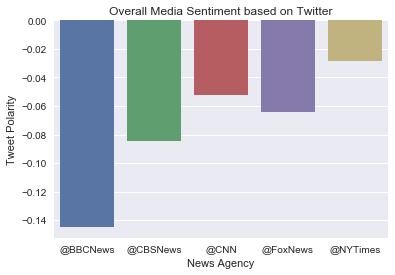

# Twitter sentiment for five major news agencies

Pull the most recent 100 tweets from BBC News, CBS News, CNN, Fox News, and the New York Times.  


```python
# Dependencies
import numpy as np
import pandas as pd
import matplotlib.pyplot as plt
import json
import tweepy
import time
from datetime import datetime
import seaborn as sns

# Initialize Sentiment Analyzer
from vaderSentiment.vaderSentiment import SentimentIntensityAnalyzer
analyzer = SentimentIntensityAnalyzer()

# Twitter API Keys
from twitterapi import consumer_key, consumer_secret, access_token, access_token_secret

# Setup Tweepy API Authentication
auth = tweepy.OAuthHandler(consumer_key, consumer_secret)
auth.set_access_token(access_token, access_token_secret)
api = tweepy.API(auth, parser=tweepy.parsers.JSONParser())
```


```python
# Target Search Term
target_users = ("@BBCNews", "@CBSNews", "@CNN", "@FoxNews", "@NYTimes")

# Variables for holding sentiments
sentiments = []

# Loop through 5 pages of tweets (total 100 tweets) for each target user
for user in (target_users):
    # Counter
    counter = 1
    for x in range(5):

        # Get all tweets from home feed
        public_tweets = api.user_timeline(user, page=x)

        # Loop through all tweets 
        for tweet in public_tweets:

            # Print Tweets
            print("Tweet %s: %s" % (counter, tweet["text"]))
        
            # Run Vader Analysis on each tweet
            compound = analyzer.polarity_scores(tweet["text"])["compound"]
            pos = analyzer.polarity_scores(tweet["text"])["pos"]
            neu = analyzer.polarity_scores(tweet["text"])["neu"]
            neg = analyzer.polarity_scores(tweet["text"])["neg"]
            tweets_ago = counter
        
            # Add sentiments for each tweet into an array
            sentiments.append({"News Agency": user,
                                "Date": tweet["created_at"], 
                               "Compound": compound,
                               "Positive": pos,
                               "Negative": neu,
                               "Neutral": neg,
                               "Tweets Ago": counter,
                              "Tweet": tweet["text"]})
        
            # Add to counter 
            counter = counter + 1


```

    Tweet 1: UK ivory ban among 'toughest' in the world, says Gove https://t.co/zs3TZKrB1d
    Tweet 2: 'One-stop shops' set to speed up cancer diagnosis https://t.co/MFhvaEqcKf
    Tweet 3: Calor gas shortages leave customers without heating https://t.co/Hs2nF3uNbg
    Tweet 4: Momentum admits Labour 'failure' over anti-Semitism https://t.co/O5zEjqutYL
    Tweet 5: Met Police investigated over death of arrested man https://t.co/t7pRlNJ8sx
    Tweet 6: RT @BBC_HaveYourSay: Have you ever had to choose between the love of your life and your favourite sports team? #harryandmeghan's #RoyalWedd…
    Tweet 7: AI 'poses less risk to jobs than feared' says OECD https://t.co/7CS3sn6n1I
    Tweet 8: RT @BBCSteveR: Russia's Foreign Minister Sergei Lavrov tells me why current tension between Moscow &amp; the West "is worse now than in the old…
    Tweet 9: Snow, rain and floods make bank holiday travels a trial https://t.co/NV1ymrEg8s
    Tweet 10: Probe launched into Wrexham's HMP Berwyn prison death https://t.co/gkFDZehazt
    Tweet 11: Nazanin Zaghari-Ratcliffe's husband 'disappointed' with Boris Johnson https://t.co/tZvEhUbyFk
    Tweet 12: Swanage sea wall car crash pedestrian dies https://t.co/DWriuVxHbl
    Tweet 13: RT @BBCBreaking: South African anti-apartheid campaigner Winnie Mandela has died aged 81, her personal assistant says https://t.co/krdVvFLY…
    Tweet 14: Russian spy: Sergei Lavrov accuses West of 'children's games' https://t.co/MQX5K9gCd0
    Tweet 15: RT @BBCRosAtkins: Back in Jan 2017, my show Outside Source decided to try a self-monitoring system to increase our number of women contribu…
    Tweet 16: RT @BBCRosAtkins: This is a video the BBC’s made to show how a self-monitoring system we introduced on @BBCOS has increased the number of w…
    Tweet 17: Men in court over £1.3m Dromore drugs haul https://t.co/QbO24Ovddz
    Tweet 18: Alan Pardew: West Bromwich Albion part company with manager https://t.co/Tr0fshEmqo
    Tweet 19: 'More than half' of UK households face broadband problems https://t.co/muaUtmMWMO
    Tweet 20: Soldier dies in 'tragic diving incident' near Chepstow https://t.co/J2V3QgQt9z
    Tweet 21: UK ivory ban among 'toughest' in the world, says Gove https://t.co/zs3TZKrB1d
    Tweet 22: 'One-stop shops' set to speed up cancer diagnosis https://t.co/MFhvaEqcKf
    Tweet 23: Calor gas shortages leave customers without heating https://t.co/Hs2nF3uNbg
    Tweet 24: Momentum admits Labour 'failure' over anti-Semitism https://t.co/O5zEjqutYL
    Tweet 25: Met Police investigated over death of arrested man https://t.co/t7pRlNJ8sx
    Tweet 26: RT @BBC_HaveYourSay: Have you ever had to choose between the love of your life and your favourite sports team? #harryandmeghan's #RoyalWedd…
    Tweet 27: AI 'poses less risk to jobs than feared' says OECD https://t.co/7CS3sn6n1I
    Tweet 28: RT @BBCSteveR: Russia's Foreign Minister Sergei Lavrov tells me why current tension between Moscow &amp; the West "is worse now than in the old…
    Tweet 29: Snow, rain and floods make bank holiday travels a trial https://t.co/NV1ymrEg8s
    Tweet 30: Probe launched into Wrexham's HMP Berwyn prison death https://t.co/gkFDZehazt
    Tweet 31: Nazanin Zaghari-Ratcliffe's husband 'disappointed' with Boris Johnson https://t.co/tZvEhUbyFk
    Tweet 32: Swanage sea wall car crash pedestrian dies https://t.co/DWriuVxHbl
    Tweet 33: RT @BBCBreaking: South African anti-apartheid campaigner Winnie Mandela has died aged 81, her personal assistant says https://t.co/krdVvFLY…
    Tweet 34: Russian spy: Sergei Lavrov accuses West of 'children's games' https://t.co/MQX5K9gCd0
    Tweet 35: RT @BBCRosAtkins: Back in Jan 2017, my show Outside Source decided to try a self-monitoring system to increase our number of women contribu…
    Tweet 36: RT @BBCRosAtkins: This is a video the BBC’s made to show how a self-monitoring system we introduced on @BBCOS has increased the number of w…
    Tweet 37: Men in court over £1.3m Dromore drugs haul https://t.co/QbO24Ovddz
    Tweet 38: Alan Pardew: West Bromwich Albion part company with manager https://t.co/Tr0fshEmqo
    Tweet 39: 'More than half' of UK households face broadband problems https://t.co/muaUtmMWMO
    Tweet 40: Soldier dies in 'tragic diving incident' near Chepstow https://t.co/J2V3QgQt9z
    Tweet 41: RT @bbcweather: 4cm of #snow has already fallen in Bingley, W Yorkshire, 3cm in Leek, Staffordshire, 2cm in Aviemore, Highland and 1cm in N…
    Tweet 42: RT @BBCr4today: Doctors have warned that winter pressures on hospitals in England are likely to extend into the summer. Dr Chaand Nagpaul,…
    Tweet 43: Two dead and one arrested after 'wrong-way' M62 crash https://t.co/KqmsR1PiID
    Tweet 44: RT @BBCWiltshire: A Wiltshire soldier's died in a diving accident during an army training course - Lance Corporal George Partridge was with…
    Tweet 45: Director of public prosecutions Alison Saunders to stand down https://t.co/1NydzCaUGr
    Tweet 46: BBC wants gender balance of contributors by April 2019 https://t.co/aJAtycp02S
    Tweet 47: Mission to demonstrate space junk tech https://t.co/8EyoySAntr
    Tweet 48: Child poverty: Pale and hungry pupils 'fill pockets with school food' https://t.co/KKviJi7FuJ
    Tweet 49: Aggressive bailiff behaviour remains 'lingering concern' - MoJ review https://t.co/vxUXd5dOxU
    Tweet 50: UK winemakers toast record year https://t.co/M85g0Cc1mN
    Tweet 51: Silsden gas loss: Thousands face third day without supplies https://t.co/BR0ru9BvBh
    Tweet 52: Broken neck girl begins to walk again https://t.co/As2pxfUom6
    Tweet 53: London murder rate overtakes New York's https://t.co/JLyng8LWhO
    Tweet 54: RT @BBCSteveR: UK-Russia war of words over Salisbury:
    
    🇬🇧 about 🇷🇺
    reckless, despicable, culpable, malign, aggression, flagrant, barbaric,…
    Tweet 55: Eddie Izzard calls for Labour to 'stamp out' anti-Semitism https://t.co/vnZHIRCgKt
    Tweet 56: 😆😂🤣
    
    https://t.co/qjCDvEa0BI
    Tweet 57: Two unaccounted for after Knock house blaze https://t.co/T6zIznpzGZ
    Tweet 58: The Queen, Prince William and Catherine have attended an Easter service at Windsor Castle
    
    https://t.co/e9XSQsTtz0 https://t.co/9djlDBmqUP
    Tweet 59: RT @BBCSteveR: Why's Russian TV showing the inventor of the sandwich (the Earl of Sandwich) in a report on the Skripals? Anchor: blaming Ru…
    Tweet 60: Baby 'in cardiac arrest' at West Midland Safari Park https://t.co/RPgsXzxtEh
    Tweet 61: Did you get caught out on April Fools day?
    
    @RogerJ_01 and @BabitaBBC did on @BBCBreakfast thanks to a newspaper re… https://t.co/XPejEoUgsY
    Tweet 62: Queen attends Easter service at Windsor without Prince Philip https://t.co/CIc7tydUZz
    Tweet 63: Three WW2 aircraft - a Spitfire T9, Spitfire Mk IX and a Hawker Hurricane X - fly over wartime airfield Biggin Hill… https://t.co/BYe6r7JrYu
    Tweet 64: RT @BBCWorld: Inside the armoured green train used by Kim Jong-un on his trip to China https://t.co/C7djAnrGEC
    Tweet 65: RT @BBCScotlandNews: Bottle return scheme "should be UK-wide" https://t.co/JYZtsOAQd7 https://t.co/idYxOPNPxJ
    Tweet 66: RT @BBCWorld: See you later Alligator. 🐊 
    
    https://t.co/hHMns7Dpwo https://t.co/f9TkLjsMot
    Tweet 67: RT @bbcweather: Last night saw the second (and final) #BlueMoon of 2018 and our #WeatherWatchers managed to find some breaks in the cloud t…
    Tweet 68: RT @BBCSport: It was a controlled performance from Anthony Joshua last night.
    
    But Joseph Parker took him all the way.
    
    Read👉https://t.co/u…
    Tweet 69: RT @BBCScotlandNews: The forgotten Scot who was the RAF's founding father https://t.co/GiGYlx9Nx3 https://t.co/PjGjY2MOhU
    Tweet 70: Woman arrested after Edinburgh firearms incident https://t.co/Yby0jbo9QY
    Tweet 71: Northern Ireland boy killed in Tenerife hit and run https://t.co/dQlwuVFmfa
    Tweet 72: Man charged as Haringey murder victim named https://t.co/kkEvBzHilX
    Tweet 73: PM uses Easter message to praise "the triumph of the human spirit" as she recalls people affected by last year's te… https://t.co/bf5fS2q5ql
    Tweet 74: Northamptonshire suffering "massive increase" in gang activity https://t.co/IrfQZwJRrn
    Tweet 75: RT @BBC_HaveYourSay: Have you been invited to #harryandmeghan's #RoyalWedding on 19 May? 
    If you have, we'd like to hear from you. Email ha…
    Tweet 76: Child burial fees waived in England https://t.co/ttub5URCE2
    Tweet 77: PM reflects on Britain's 'dark moments' in Easter message https://t.co/OGCZM4XDGP
    Tweet 78: Increased fines for 'litter louts' come into effect https://t.co/rxLeoXf4tC
    Tweet 79: Labour Party 'not connected' to abusive anti-Jewish messages https://t.co/IfvZULgE9E
    Tweet 80: Royal wedding: Prince Harry and Meghan Markle choose flowers https://t.co/bEV8gIGXKN
    Tweet 81: Special needs cash shortfall 'leaves thousands of pupils unplaced' https://t.co/cdDPMiO6XY
    Tweet 82: Anthony Joshua beats Joseph Parker on points to add WBO world heavyweight title https://t.co/wK0SKDNiWQ
    Tweet 83: Spy poisoning: UK plays down Russia complaint at plane search https://t.co/HCb3NrprDP
    Tweet 84: Women found dead six hours after Basingstoke crash 'were amazing' https://t.co/z3VZRL4XnE
    Tweet 85: 8-year-old Alexa is going blind — she's created a list of things she wants to see before that happens ❤️ https://t.co/dr2Nrg3wkp
    Tweet 86: RT @ChrisMasonBBC: Christine Shawcroft will be replaced on Labour's National Executive Committee by Eddie Izzard
    Tweet 87: Shawcroft quits Labour ruling body https://t.co/P87CTEHuQT
    Tweet 88: RT @BBCSport: An inspirational young man. 👏
    
    Billy Monger, who had both his legs amputated after a crash last year, finished third on his B…
    Tweet 89: RT @BBCSteveR: After reading today's Russian papers, I have some good news &amp; some bad news. The good news: this isn't a new cold war. The b…
    Tweet 90: RT @BBCSport: FT: Brighton 0-2 Leicester
    
    It all happened late on at the Amex! Brighton miss a penalty, Leicester score two.
    
    https://t.co/…
    Tweet 91: RT @BBCSport: FT: West Brom 1-2 Burnley 
    
    It's eight successive defeats for West Brom.
    
    A great result for Burnley though, who tighten thei…
    Tweet 92: RT @BBCSport: FT: Watford 2-2 Bournemouth 
    
    Loads of drama in this one! 
    
    Four goals, including a stoppage time equaliser, plus one of the…
    Tweet 93: RT @BBCSport: FT: Manchester United 2-0 Swansea City 
    
    Two goals in the first-half gives #MUFC a comfortable home victory.
    
    https://t.co/tJ…
    Tweet 94: RT @BBCSport: FT: Newcastle United 1-0 Huddersfield Town 
    
    Ayoze Perez wins it for #NUFC! 
    
    #NEWHUD https://t.co/tJig6BnJWN https://t.co/xN…
    Tweet 95: UK soldier killed fighting IS in Syria named as Sgt Matt Tonroe https://t.co/FdCOYujDst
    Tweet 96: Redcar rescue: Four saved from sea by human chain https://t.co/ezQYF3dHZZ
    Tweet 97: RT @BBC_HaveYourSay: NHS at 70: We want your stories and memories of the #NHS from across the decades. Everyone from patients to doctors ar…
    Tweet 98: IS 'Beatles duo' complaints anger murdered David Haines's daughter https://t.co/fSB2vzlxuu
    Tweet 99: RT @BBCLondonNews: Man finds 'glistening' jewelled ring on London train https://t.co/g4uQpYVjZA https://t.co/MpiyoQ03t8
    Tweet 100: RT @BBCSport: Former British boxing champion Chris Edwards has died at the age of 41.
    https://t.co/1xhQwEeUDW https://t.co/WRC7zfykVO
    Tweet 1: Video appears to show two Fort Worth officers repeatedly punching 35-year-old Forrest Curry while trying to place h… https://t.co/9dav3S0ibk
    Tweet 2: The "Affluenza teen" is a free man. Ethan Couch, known for blaming his wealthy upbringing on a drunken crash that k… https://t.co/MXsy20pJDS
    Tweet 3: RT @CBSEveningNews: MORE TO WATCH:
    
     "We always thought, growing up, that  J. Edgar Hoover, and his FBI at that time, definitely had some d…
    Tweet 4: This is World Autism Awareness Day, and employers are becoming aware that adults with autism can be a great source… https://t.co/7WqcdvEJdQ
    Tweet 5: How far do you have to go to keep your identity a secret when you're online? As @tonydokoupil found out, staying an… https://t.co/lMiGinFmiR
    Tweet 6: "He was a doer, not just a dreamer." Fifty years ago Dr. Martin Luther King, Jr. was assassinated in Memphis. King'… https://t.co/WVR0NPFZpi
    Tweet 7: Hundreds of schools were closed today in Oklahoma and Kentucky. Thousands of teachers walked out of classrooms to r… https://t.co/WXV9sgTWA1
    Tweet 8: Bystanders captured video of Fort Worth officers punching 35-year-old Forrest Curry as they tried to arrest him. Hi… https://t.co/WLsPzDbijG
    Tweet 9: President Trump said DACA is dead because Democrats didn't care or act. @MajorCBS has more on this.… https://t.co/rTHY5OI3ld
    Tweet 10: "Winter is not letting go so easy," @ericfisher says as a spring snowstorm has swept from the Midwest to the Northe… https://t.co/MR3QamG0wi
    Tweet 11: RT @CBSEveningNews: The Dow plunged as much as 700, hitting its low for the year before recovering some and closing with a loss of 458 poin…
    Tweet 12: Fired deputy FBI Director Andrew McCabe said Monday that he will stop gathering GoFundMe donations for his legal de… https://t.co/pl7ZX0bLyT
    Tweet 13: Massachusetts man falsely accused as gunman in Parkland shooting is suing Alex Jones and InfoWars for defamation… https://t.co/zxOkZQypIP
    Tweet 14: Rep. Elizabeth Esty (D-CT) will not seek reelection, she announces; some had previously called for her resignation… https://t.co/ynR76ngYTT
    Tweet 15: China tariffs on U.S. products are "significant," CBS News senior global affairs contributor says, but "we're not i… https://t.co/2ifBFBI9ik
    Tweet 16: Pres. Trump jumped to the defense of Sinclair Broadcast Group, which is under fire following the rapid spread of a… https://t.co/BPHClEbue8
    Tweet 17: After being found in more and more overdose deaths, gabapentin, a drug that has been touted as a safe alternative t… https://t.co/l2yzH2vwHR
    Tweet 18: Police have arrested two former day care workers, who allegedly lifted kids into the air, violently slammed them on… https://t.co/J6sD3srQcH
    Tweet 19: Cold, snowy weather is not only impacting the start of spring -- it's also impacting the start of baseball season… https://t.co/x4sznrHlTf
    Tweet 20: "Condom snorting" is the newest viral trend among teens on social media. And like the Tide Pod Challenge before it,… https://t.co/Uh6rRGNvV3
    Tweet 21: Video appears to show two Fort Worth officers repeatedly punching 35-year-old Forrest Curry while trying to place h… https://t.co/9dav3S0ibk
    Tweet 22: The "Affluenza teen" is a free man. Ethan Couch, known for blaming his wealthy upbringing on a drunken crash that k… https://t.co/MXsy20pJDS
    Tweet 23: RT @CBSEveningNews: MORE TO WATCH:
    
     "We always thought, growing up, that  J. Edgar Hoover, and his FBI at that time, definitely had some d…
    Tweet 24: This is World Autism Awareness Day, and employers are becoming aware that adults with autism can be a great source… https://t.co/7WqcdvEJdQ
    Tweet 25: How far do you have to go to keep your identity a secret when you're online? As @tonydokoupil found out, staying an… https://t.co/lMiGinFmiR
    Tweet 26: "He was a doer, not just a dreamer." Fifty years ago Dr. Martin Luther King, Jr. was assassinated in Memphis. King'… https://t.co/WVR0NPFZpi
    Tweet 27: Hundreds of schools were closed today in Oklahoma and Kentucky. Thousands of teachers walked out of classrooms to r… https://t.co/WXV9sgTWA1
    Tweet 28: Bystanders captured video of Fort Worth officers punching 35-year-old Forrest Curry as they tried to arrest him. Hi… https://t.co/WLsPzDbijG
    Tweet 29: President Trump said DACA is dead because Democrats didn't care or act. @MajorCBS has more on this.… https://t.co/rTHY5OI3ld
    Tweet 30: "Winter is not letting go so easy," @ericfisher says as a spring snowstorm has swept from the Midwest to the Northe… https://t.co/MR3QamG0wi
    Tweet 31: RT @CBSEveningNews: The Dow plunged as much as 700, hitting its low for the year before recovering some and closing with a loss of 458 poin…
    Tweet 32: Fired deputy FBI Director Andrew McCabe said Monday that he will stop gathering GoFundMe donations for his legal de… https://t.co/pl7ZX0bLyT
    Tweet 33: Massachusetts man falsely accused as gunman in Parkland shooting is suing Alex Jones and InfoWars for defamation… https://t.co/zxOkZQypIP
    Tweet 34: Rep. Elizabeth Esty (D-CT) will not seek reelection, she announces; some had previously called for her resignation… https://t.co/ynR76ngYTT
    Tweet 35: China tariffs on U.S. products are "significant," CBS News senior global affairs contributor says, but "we're not i… https://t.co/2ifBFBI9ik
    Tweet 36: Pres. Trump jumped to the defense of Sinclair Broadcast Group, which is under fire following the rapid spread of a… https://t.co/BPHClEbue8
    Tweet 37: After being found in more and more overdose deaths, gabapentin, a drug that has been touted as a safe alternative t… https://t.co/l2yzH2vwHR
    Tweet 38: Police have arrested two former day care workers, who allegedly lifted kids into the air, violently slammed them on… https://t.co/J6sD3srQcH
    Tweet 39: Cold, snowy weather is not only impacting the start of spring -- it's also impacting the start of baseball season… https://t.co/x4sznrHlTf
    Tweet 40: "Condom snorting" is the newest viral trend among teens on social media. And like the Tide Pod Challenge before it,… https://t.co/Uh6rRGNvV3
    Tweet 41: Most Americans don't think teachers in their community are paid enough, according to a recent CBS News poll… https://t.co/vZHpmxDCu6
    Tweet 42: Taylor Swift delivers surprise performance for a crowd of approximately 40 people at Nashville's Bluebird Cafe; the… https://t.co/UMEOcyBNzu
    Tweet 43: When Dr. Martin Luther King Jr. was murdered, 50 years ago this week, Martin the third, Dexter &amp; Bernice King were… https://t.co/pa6jBHsZCn
    Tweet 44: "We are the future. Our students are the future. And they need to fund our future." Thousands of teachers flooded t… https://t.co/CbJL1Tm27R
    Tweet 45: Forget the Easter Bunny. A family in Florida just had a run-in with the Easter Alligator and caught the whole thing… https://t.co/L0OVvVCWQW
    Tweet 46: With a record number of women running for office, departing Planned Parenthood president Cecile Richards tells… https://t.co/WzbzldGUMY
    Tweet 47: Congressional Democrats raise ethics questions about Trump defense fund https://t.co/n0aG5IFtd2 https://t.co/mdN3GCZkmj
    Tweet 48: Reporter: "Mr. President, what about the DACA kids?"
    Pres. Trump: "The Democrats have really let them down."
    The pr… https://t.co/a7QJVCKqbQ
    Tweet 49: Winnie Madikizela-Mandela, the ex-wife of former South African leader Nelson Mandela -- and a political force and c… https://t.co/7QlgDL3gga
    Tweet 50: Kremlin says President Trump invited Russian President Vladimir Putin to the White House https://t.co/mCoDVmE0C9 https://t.co/s7IkH0xepf
    Tweet 51: President Trrump defends Sinclair Broadcast after Deadspin video shows anchors reading a script criticizing "fake"… https://t.co/PENwsHCezG
    Tweet 52: Syria's Assad poised for another huge symbolic victory as the biggest rebel group in eastern Ghouta suburbs of Dama… https://t.co/Ooh8DPQ6DU
    Tweet 53: A 13 year old who fell into a Los Angeles sewage pipe has been found alive after 8 hours in the "toxic environment… https://t.co/Ipjrcll50R
    Tweet 54: Kremlin insists billionaire's arrest part of anti-corruption fight https://t.co/XSTFfqom4I https://t.co/V8dAXoW42B
    Tweet 55: The Easter Egg Roll -- one of the oldest White House traditions -- kicks off after remarks from @POTUS. Members of… https://t.co/VFaqLIvCip
    Tweet 56: “Our military is at a level where it has never been before….The funding of our military was so important and so man… https://t.co/F8q3TCZAN4
    Tweet 57: “Our country is doing great. You look at the economy. You look at what is happening. Nothing’s ever easy, but we ha… https://t.co/vgjv53XWIz
    Tweet 58: “I want to really thank the first lady, Melania, who has done an incredible job. She worked so hard on this event a… https://t.co/4cwNWykO9Q
    Tweet 59: Sheriff's deputy's vehicle strikes activist protesting Stephon Clark's death https://t.co/4G5Vc2Hcur https://t.co/B1P3mMZt1V
    Tweet 60: Former New Jersey Gov. Chris Christie on EPA Administrator Scott Pruitt controversy: "I don't know how you survive… https://t.co/zyzChLdVs7
    Tweet 61: WATCH: President Trump and first lady Melania Trump host the annual "Easter Egg Roll" at the White House… https://t.co/0TfDZpIdA3
    Tweet 62: Madikizela-Mandela was, along with her ex-husband, a key figure in the fight to end the racist Apartheid system imp… https://t.co/4zJ1mlOk9I
    Tweet 63: Winnie Madikizela-Mandela, Nelson Mandela's wife, has passed away at 81. "She died after a long illness... She succ… https://t.co/IxdZM6bG3O
    Tweet 64: 5 tips for Mark Zuckerberg's day in Congress: PR pros who prep CEOs for such high-stakes public grillings have stro… https://t.co/bHchCZp5Vs
    Tweet 65: China's tariff hikes: Here are the U.S. products getting hit https://t.co/cSiIu9dLzG https://t.co/Tv5UlYJAIn
    Tweet 66: President Trump says he wants skilled immigrants, but raises new obstacles https://t.co/d1YKuGhlqr https://t.co/95kqlLWI6d
    Tweet 67: In a three-page memo obtained by the AP, White House "talking points" lay out seven "lies" that it said Shulkin had… https://t.co/kcPDqFGb6O
    Tweet 68: Japan's Shinzo Abe to visit Mar-a-Lago to discuss North Korea with Trump https://t.co/PXXDvKNM63 https://t.co/ljsJoSR1e4
    Tweet 69: "We don't normally handle these situations, and it feels great to help directly bring a new life into this world,"… https://t.co/UOk64ypwxs
    Tweet 70: Missouri GOP Senate candidate Josh Hawley sidesteps question on Trump's behavior https://t.co/HKByFWYNOI https://t.co/jVcsEzb9iL
    Tweet 71: Biologists are challenging the idea of naturalist Charles Darwin that evolution can not be observed in real time. U… https://t.co/jsPlcM34p6
    Tweet 72: A firefighter surprised two young girls at their home in Ohio, but when he took off his mask and helmet, they reali… https://t.co/azLZXi40q6
    Tweet 73: Here’s a look at this morning’s other headlines on @CBSThisMorning: https://t.co/XrcsXi5mE7
    Tweet 74: Pres. Trump tweets "DACA is dead" after spending Easter slamming Mexico, Democrats https://t.co/YF1x2TLrwG https://t.co/grH8B4YzWc
    Tweet 75: Dr. Martin Luther King Jr.’s children speak about their father's legacy and say he was far more radical in his idea… https://t.co/IDwaJAhhb4
    Tweet 76: This week marks the 50th anniversary of the assassination of Dr. Martin Luther King Jr. Only on CBS News,… https://t.co/aVbFkZoB5v
    Tweet 77: Dr. Martin Luther King Jr. was assassinated 50 years ago this week. Ahead and only on CBS News, his children reflec… https://t.co/HdWB5LFyPj
    Tweet 78: Student protestors at Howard University are entering their fifth straight day occupying schools' administrative bui… https://t.co/BLjSItWnQD
    Tweet 79: China's new tariffs on American products take effect today amid heightened tensions over trade. China announced the… https://t.co/t24wWKU3AP
    Tweet 80: Lawmakers are pushing back against Pres. Trump’s vow that there will be no deal to save the DACA program. Trump twe… https://t.co/9L0uerUbZ9
    Tweet 81: China's defunct space station, Tiangong 1, re-entered the Earth's atmosphere after 8 p.m. ET Sunday, mostly burning… https://t.co/GL05Ea97Iv
    Tweet 82: Here’s a look at this morning’s other headlines on @CBSThisMorning https://t.co/f4C84V3fes
    Tweet 83: French President Emmanuel Macron spoke with @WIRED editor-in-chief and CBS News contributor @nxthompson and said th… https://t.co/lapQy4yBF6
    Tweet 84: With tech companies tracking us online, @TonyDokoupil tried to see if it's even possible to shop online without giv… https://t.co/DkjoVscPfY
    Tweet 85: The entertainment world is remembering TV writer and producer Steven Bochco. He died yesterday after a long battle… https://t.co/l1CXWlwCZt
    Tweet 86: Investigators say the crash off a California cliff that killed a Washington state family may have been intentional.… https://t.co/sB5ib4qmJy
    Tweet 87: Here are three things you should know this morning:
    1⃣Russia tests anti-ballistic missile
    2⃣Jury selection in Cosby… https://t.co/LOc78SUdKs
    Tweet 88: Remembering Steven Bochco, TV creator of "Hill Street Blues" and "NYPD Blue"  https://t.co/WSUBh4bjsu https://t.co/c9qH6fN0l7
    Tweet 89: Millions of shoppers at Saks Fifth Avenue, Saks off Fifth and Lord &amp; Taylor may be impacted by a massive data breac… https://t.co/uuShVNJaAa
    Tweet 90: The Sacramento Sheriff's Dept. will release more information after one of its vehicles hit a protester Saturday. A… https://t.co/9rbgV8uU1j
    Tweet 91: Hundreds of schools in Oklahoma and Kentucky are closed today as thousands of teachers prepare to rally at their St… https://t.co/fnhKnkN1WP
    Tweet 92: Pieces of the defunct Chinese space station crashed overnight into a remote part of the South Pacific. The Tiangong… https://t.co/imDW8ErDPs
    Tweet 93: A Spring snowstorm is affecting 35 million people in the East. Around two inches could fall in New York, while part… https://t.co/muCYhKqdeY
    Tweet 94: China imposed significant tariffs overnight on more than 100 imported American goods. The move is in retaliation fo… https://t.co/rKLZNq7kXj
    Tweet 95: President Trump promised no more immigration talks with Congress and also threatened to end NAFTA if Mexico does no… https://t.co/lE5eMedCDw
    Tweet 96: Fifty years after Martin Luther King Jr.'s assassination, a vast majority of Americans call him a very important hi… https://t.co/YAQvi03t6g
    Tweet 97: This week marks the 50th anniversary of the assassination of Dr. Martin Luther King Jr. Ahead on @CBSThisMorning,… https://t.co/QpD6pxc3LY
    Tweet 98: Investigators say the crash off a California cliff that killed a Washington state family may have been intentional.… https://t.co/NzOyR1yVM5
    Tweet 99: AHEAD on @CBSThisMorning: @CecileRichards is entering her final weeks at the helm of Planned Parenthood. She will s… https://t.co/SfBSB1MKV8
    Tweet 100: Deadly SUV cliff crash that killed a Washington state family may have been intentional, according preliminary evide… https://t.co/mJaZ2mMNeI
    Tweet 1: CNN's @ErinBurnett: "The President talks the tough talk on firing. But when it comes down to it, he isn't saying th… https://t.co/yRkBi4aPUh
    Tweet 2: RT @OutFrontCNN: "It's not a dog whistle. It's a foghorn. ... It's simply racist to say that people are stealing our country." - Democratic…
    Tweet 3: 4 groups that are warming up to Donald Trump | Analysis by @CillizzaCNN https://t.co/XlCSBzqcHD https://t.co/bNatECK1LM
    Tweet 4: "Is this America's new face to the world?" asks Ruth Ben-Ghiat, writing via @CNNOpinion about this photo of White H… https://t.co/emYfkdkufe
    Tweet 5: A Florida middle school teacher is resigning after it was found she was also the host of a white supremacist podcas… https://t.co/AjDkPaplrX
    Tweet 6: Trump is obsessed with going 'nuclear' in the Senate | Analysis by CNN's Z. Byron Wolf https://t.co/ILKDLi4fWQ https://t.co/zP0OaZKdvk
    Tweet 7: Roger Stone's potential ties to WikiLeaks and its founder, Julian Assange, are being investigated by special counse… https://t.co/wRd2OcAxi1
    Tweet 8: Intel shares dipped several percentage points on a report that Apple plans to start making its own processors for M… https://t.co/6jtXt1rfpS
    Tweet 9: President Trump has nominated Justin Muzinich as the Treasury Department's deputy secretary. He will serve as Treas… https://t.co/P5ptl6e76M
    Tweet 10: California's attorney general sued Sutter Health, accusing the hospital giant of illegally quashing competition and… https://t.co/OX5B6cII9E
    Tweet 11: RT @CNNSitRoom: If President Trump pulls the US out of Syria, he will “pay a price ... from a history’s point of view,” former CIA Director…
    Tweet 12: The Environment Protection Agency wants to give automakers a break on emissions rules established under the Obama A… https://t.co/pHrCejgpAI
    Tweet 13: Wall Street is sending President Trump a message: Don't start a trade war. And lay off Amazon, one of the most impo… https://t.co/d53hoXQ0KQ
    Tweet 14: RT @CNNSitRoom: After President Trump called the DOJ and FBI an embarrassment to our country, Rep. Castro says he’s surprised that Jeff Ses…
    Tweet 15: How office buildings are reducing their carbon footprint https://t.co/wpTo0rT1Re https://t.co/f5BnMN5Sov
    Tweet 16: The National Institute on Alcohol Abuse and Alcoholism is coming under scrutiny over communications with the alcoho… https://t.co/7iQzWF9C64
    Tweet 17: The Trump administration is reconsidering its proposal to sharply increase entry fees at some popular national park… https://t.co/5unIjFba2q
    Tweet 18: RT @TheLeadCNN: Sinclair responds to criticism of their media-bashing promos that TV anchors were forced to read https://t.co/f3NrQGtVBK ht…
    Tweet 19: One day after Vermont lawmakers approved sweeping gun control measures that include limits on the size of magazines… https://t.co/d0ala3G2qY
    Tweet 20: Democratic Rep. Elizabeth Esty announces she is not seeking re-election after revelations that she kept her chief o… https://t.co/IyJfBqMiuC
    Tweet 21: CNN's @ErinBurnett: "The President talks the tough talk on firing. But when it comes down to it, he isn't saying th… https://t.co/yRkBi4aPUh
    Tweet 22: RT @OutFrontCNN: "It's not a dog whistle. It's a foghorn. ... It's simply racist to say that people are stealing our country." - Democratic…
    Tweet 23: 4 groups that are warming up to Donald Trump | Analysis by @CillizzaCNN https://t.co/XlCSBzqcHD https://t.co/bNatECK1LM
    Tweet 24: "Is this America's new face to the world?" asks Ruth Ben-Ghiat, writing via @CNNOpinion about this photo of White H… https://t.co/emYfkdkufe
    Tweet 25: A Florida middle school teacher is resigning after it was found she was also the host of a white supremacist podcas… https://t.co/AjDkPaplrX
    Tweet 26: Trump is obsessed with going 'nuclear' in the Senate | Analysis by CNN's Z. Byron Wolf https://t.co/ILKDLi4fWQ https://t.co/zP0OaZKdvk
    Tweet 27: Roger Stone's potential ties to WikiLeaks and its founder, Julian Assange, are being investigated by special counse… https://t.co/wRd2OcAxi1
    Tweet 28: Intel shares dipped several percentage points on a report that Apple plans to start making its own processors for M… https://t.co/6jtXt1rfpS
    Tweet 29: President Trump has nominated Justin Muzinich as the Treasury Department's deputy secretary. He will serve as Treas… https://t.co/P5ptl6e76M
    Tweet 30: California's attorney general sued Sutter Health, accusing the hospital giant of illegally quashing competition and… https://t.co/OX5B6cII9E
    Tweet 31: RT @CNNSitRoom: If President Trump pulls the US out of Syria, he will “pay a price ... from a history’s point of view,” former CIA Director…
    Tweet 32: The Environment Protection Agency wants to give automakers a break on emissions rules established under the Obama A… https://t.co/pHrCejgpAI
    Tweet 33: Wall Street is sending President Trump a message: Don't start a trade war. And lay off Amazon, one of the most impo… https://t.co/d53hoXQ0KQ
    Tweet 34: RT @CNNSitRoom: After President Trump called the DOJ and FBI an embarrassment to our country, Rep. Castro says he’s surprised that Jeff Ses…
    Tweet 35: How office buildings are reducing their carbon footprint https://t.co/wpTo0rT1Re https://t.co/f5BnMN5Sov
    Tweet 36: The National Institute on Alcohol Abuse and Alcoholism is coming under scrutiny over communications with the alcoho… https://t.co/7iQzWF9C64
    Tweet 37: The Trump administration is reconsidering its proposal to sharply increase entry fees at some popular national park… https://t.co/5unIjFba2q
    Tweet 38: RT @TheLeadCNN: Sinclair responds to criticism of their media-bashing promos that TV anchors were forced to read https://t.co/f3NrQGtVBK ht…
    Tweet 39: One day after Vermont lawmakers approved sweeping gun control measures that include limits on the size of magazines… https://t.co/d0ala3G2qY
    Tweet 40: Democratic Rep. Elizabeth Esty announces she is not seeking re-election after revelations that she kept her chief o… https://t.co/IyJfBqMiuC
    Tweet 41: RT @TheLeadCNN: Dem. Senator Mazie Hirono calls President Trump's suggestion to pull US troops out of Syria another example of his "incoher…
    Tweet 42: The White House says a new immigration push is coming as President Trump posts a string of tweets pushing a hard li… https://t.co/OK9Gv0UIgL
    Tweet 43: Democratic Rep. Elizabeth Esty announces she is not seeking re-election after revelations that she kept her chief o… https://t.co/1Q9XuyMgg7
    Tweet 44: CNN has learned that the US military is discussing sending more troops to Syria; US President Trump remarked last T… https://t.co/MsQvMGNVkj
    Tweet 45: Elizabeth Esty just bowed to the inevitable | Analysis by @CillizzaCNN https://t.co/5X8xQd1n9A https://t.co/Q5GbV1PgS9
    Tweet 46: A Democratic candidate in Kentucky said she will pull her campaign ads from a local Sinclair station, and called on… https://t.co/OKuTLtQHkK
    Tweet 47: RT @TheLeadCNN: CNN has learned that the US military is discussing sending more troops to Syria, as Trump said last Thursday that the US wo…
    Tweet 48: The conservative majority is undermining worker protections from the 1930s, Justice Ruth Bader Ginsburg wrote, "wit… https://t.co/iHkbwYngxo
    Tweet 49: RT @CNNnewsroom: Sinclair Broadcasting’s “fake news" promo sounds "a lot like pro-Trump anti-media messaging” says CNN’s @brianstelter http…
    Tweet 50: If Trump really wanted a DACA deal, there'd be a DACA deal | Analysis by CNN's Gregory Krieg https://t.co/IPTcxApUSu https://t.co/hP4h2kjGKC
    Tweet 51: New York tightens gun restrictions for domestic abusers https://t.co/RHjSk55MQn https://t.co/e9RUJJJX70
    Tweet 52: A dingy, old painting found in an Iowa art gallery's closet turns out to be the work of a 16th-century Dutch master… https://t.co/OpnL196Rkr
    Tweet 53: President Trump puts hold on more than $200 million in Syria recovery funds https://t.co/UV71l7zsDf https://t.co/UIGBGCK6rK
    Tweet 54: BREAKING: The Dow drops 459 points as trade tensions rise. Amazon loses 5% after Trump's Twitter attacks on the int… https://t.co/WwKMdPAiiu
    Tweet 55: Amelia Gray Hamlin, the daughter of actors Lisa Rinna and Harry Hamlin, revealed on Instagram that she struggled wi… https://t.co/YlfOQR3mkX
    Tweet 56: Pope Francis used his Easter Sunday address to call for "reconciliation for the Holy Land," in an apparent referenc… https://t.co/kxDMzalVhT
    Tweet 57: RT @CNNMoney: Dow closes down 459 points on trade war fears, tech drop. Nasdaq sinks 2.7%. Amazon loses 5% after Trump attack. https://t.co…
    Tweet 58: Pernilla Lindberg wins her first title at her 250th professional tournament -- and it's a major… https://t.co/pShnuskrXn
    Tweet 59: RT @CNNnewsroom: Our textbooks are so outdated they "talk about going to your local librarian so they can talk to you about this new thing…
    Tweet 60: A lawyer for President Trump has begun the process of appealing last month's decision by a New York judge to allow… https://t.co/5N5V3yaEw6
    Tweet 61: An official with the US Immigration and Customs Enforcement office in San Francisco apologized for posting an image… https://t.co/NNBmMXOTrL
    Tweet 62: Losing MLK "hurts all the time," but we fight on, Jesse Jackson says https://t.co/NUfuH4Chuc via @CNNOpinion https://t.co/QGS3mQzJal
    Tweet 63: Why Sinclair matters: The company is the largest owner of local TV stations in the US, and local news is Americans'… https://t.co/FtwlHH0iZH
    Tweet 64: Sinclair's fake-news zombies should terrify you | By David Rothkopf via @CNNOpinion https://t.co/rmEhwdbIdR https://t.co/G9vZz0YIQw
    Tweet 65: A coal power company files for bankruptcy and asks President Trump for a bailout https://t.co/BHqry0OJUr https://t.co/qIhW9NhYgV
    Tweet 66: Critics are calling Sinclair's promos pro-Trump propaganda. Now the company is defending the initiative as a "corpo… https://t.co/xPRM8RxI31
    Tweet 67: Inspired by the West Virginia strike in which teachers demanded and got a pay raise from state leaders, a wave of e… https://t.co/NiKcjUGle7
    Tweet 68: Pope Francis baptized a Nigerian migrant -- who shot to fame after confronting a thief on the streets of Rome -- as… https://t.co/RBaHosr7jD
    Tweet 69: Winnie Mandela, the South African anti-apartheid activist and former wife of the late President Nelson Mandela, has… https://t.co/Ij5SXPaYsJ
    Tweet 70: This 17-year-old applied to 20 of the best universities in the US and was admitted to every single one with a full… https://t.co/kp5FbvapRr
    Tweet 71: Special counsel Robert Mueller's office is defending an agreement it made with a Dutch lawyer tied to former Trump… https://t.co/BW9R1sfmFC
    Tweet 72: These teens are marching 50 miles to Memphis -- one mile for each year since Martin Luther King Jr. was killed… https://t.co/sBWhnAmyYf
    Tweet 73: RT @CNNnewsroom: Democratic Rep. John Delaney slams Trump's attacks on Amazon as "very dangerous... It's clearly an attack on the free and…
    Tweet 74: More than three dozen people suffered severe bleeding, and one died, related to synthetic cannabinoids, according t… https://t.co/xAgbYDh6Dh
    Tweet 75: Here's why Oklahoma teachers walked out today | Analysis by @CillizzaCNN https://t.co/6ntqk05KnJ https://t.co/3eoBIjAPaQ
    Tweet 76: Marijuana legalization could help offset the opioid epidemic, studies find https://t.co/qulyDRslrm https://t.co/h8IzanZE3D
    Tweet 77: China hits the United States with tariffs on $3 billion of exports https://t.co/nNT3krXSkn https://t.co/ioqEwtkFiQ
    Tweet 78: White House confirms President Trump and Russian President Vladimir Putin discussed the possibility of meeting at t… https://t.co/EgQnltqxbh
    Tweet 79: A family's SUV found at the bottom of a California cliff last week may have been deliberately driven off the road,… https://t.co/cCZRaFKWvj
    Tweet 80: Democratic Rep. John Garamendi on President Trump's comments that Democrats are to blame for not having a deal on D… https://t.co/ZCA2WWv3Sc
    Tweet 81: President Trump's attacks on Amazon are working. The company's stock sank 5% Monday after the President accused it… https://t.co/ExjxHHfLoF
    Tweet 82: This ancient Chinese art was at risk of becoming obsolete. Here's how Dragon scale bookbinding is being resurrected… https://t.co/2sq6WpMqbA
    Tweet 83: President Trump says "our country is being stolen" due to an influx of illegal immigration, blaming Democrats for w… https://t.co/6BEn0qGJaA
    Tweet 84: John Oliver compares Sinclair news anchors to “members of a brainwashed cult” https://t.co/X8xGi5jwad https://t.co/aRhiapjGCh
    Tweet 85: RT @CNNnewsroom: "Instead of finding logical sources for funding, they just want to cut and take away... Our kids deserve better" says a Ke…
    Tweet 86: Rescuers in Southern California spotted and freed a 13-year-old boy who was stuck in a maze of drainage pipes for a… https://t.co/BWqLvxe86t
    Tweet 87: The best travel photos of 2018 (so far) https://t.co/lhcuCYTYnn https://t.co/Qc11bBFpcg
    Tweet 88: RT @CNNMoney: McDonald's is tripling its tuition benefits because of the new tax law https://t.co/12QVVaIKVR https://t.co/7ljjVYO8qw
    Tweet 89: Apple is proposing 13 new emojis in an effort to better represent people with disabilities https://t.co/0LtHvSiV3b https://t.co/FlN4JhxTr5
    Tweet 90: RT @CNNnewsroom: "We would much rather be in our classrooms teaching today. I would much rather be with my students but... I need to be her…
    Tweet 91: Teachers in Oklahoma are walking out of school in protest, demanding better salaries and funding from lawmakers.
    
    W… https://t.co/NAhcoZjFw8
    Tweet 92: A gun attack by the terror group Boko Haram in northeastern Nigeria on Sunday night left 18 people dead and wounded… https://t.co/Ty0jaG4CiN
    Tweet 93: Who stands to gain if President Trump pulls the US out of Syria? https://t.co/9eoSqIuDZ3 https://t.co/1DCTPj1pT9
    Tweet 94: President Trump's latest dog whistle on immigration is more like a scream | Analysis by @CillizzaCNN… https://t.co/KG4262xGSB
    Tweet 95: Teachers in Kentucky are walking off the job today and holding rallies at the state Capitol over pension changes… https://t.co/t4812bM1cU
    Tweet 96: JUST IN: White House confirms President Trump and Russian President Vladimir Putin discussed the possibility of mee… https://t.co/B3bJx9FNol
    Tweet 97: She was too short to play Goofy. Then she invented Spanx. Now she's a billionaire. https://t.co/8UBc6YV2IU https://t.co/Bh70SauZNt
    Tweet 98: President Trump and first lady Melania Trump are hosting the 140th annual White House Easter Egg Roll… https://t.co/5T3U6IUatM
    Tweet 99: Shulkin says he was fired. The White House said he resigned. Here's why it matters. https://t.co/GQctLkajaB https://t.co/3bOKk1Yc5t
    Tweet 100: Oklahoma teachers are rallying and walking out of classes, expressing frustration over funding and salaries.
    
    Follo… https://t.co/thLk0QCQQ1
    Tweet 1: Hiker, 25, plunges to his death from dangerous Hawaii trail https://t.co/jnOC9xvQwO
    Tweet 2: The Marines ease tattoo rules, the strictest in the military https://t.co/9DctYdv5ZY
    Tweet 3: Mary Ann Mendoza, whose son was killed by an illegal immigrant: “Our politicians don’t have to negotiate or offer a… https://t.co/wnOY9R5s35
    Tweet 4: Stoneman Douglas students return to class mandatory carrying clear backpacks https://t.co/arcZRqMaEb
    Tweet 5: Kathy Griffin wants audiences to laugh off her infamous Trump photo https://t.co/8tKPI1wDsz
    Tweet 6: .@RobGronkowski fulfills heart transplant patient's 'one wish' https://t.co/QqA7uVAXEy
    Tweet 7: Amb. Geronimo Gutierrez: "[NAFTA] needs updating and modernizing and that's why we're focusing, with the U.S. and o… https://t.co/jQqfHqzF1L
    Tweet 8: EXCLUSIVE: @usairforce veteran sues after being pulled from ceremony mid-speech https://t.co/qU6Q1abWJ9
    Tweet 9: "It is in our own interest to have a secure border in our southern border and we're also in favor of having a secur… https://t.co/thC7Hy2H8W
    Tweet 10: "We certainly understand the concern not only that President #Trump has, but people in the United States here have,… https://t.co/SPRGz2QPT8
    Tweet 11: "Mexico's migration policy is to seek that any migration is legal, safe, orderly, and respectful of basic human rig… https://t.co/sClLUdlb2R
    Tweet 12: .@Schwarzenegger made his first public statement after undergoing heart surgery on Thursday.… https://t.co/odToWzLrBl
    Tweet 13: #Trump suggested @WhiteHouse as potential venue for possible Putin meeting, White House says https://t.co/YYwbgwx7Ue
    Tweet 14: Mother of 3 whose cancer was dismissed as 'breastfeeding pain' dies from disease https://t.co/glPWq6G4ie
    Tweet 15: Oklahoma, Kentucky teachers strike for higher pay, education funding https://t.co/EVREGrqOLm
    Tweet 16: .@JesseBWatters: “I support both walkouts…It was very easy to walk out a couple weeks ago, but to walk out on a pro… https://t.co/CNfn97b9o4
    Tweet 17: Radio host Howie Carr explores some of the unanswered questions of the Chappaquiddick incident and Ted Kennedy's co… https://t.co/omk9MKe1zm
    Tweet 18: .@kimguilfoyle: “@POTUS didn’t kill DACA…I think the Democrats killed it, and people who were too entrenched in the… https://t.co/h8ZaWitS9w
    Tweet 19: JUST IN: Rep. Elizabeth Esty, D-Conn., won't seek re-election amid backlash over her handling of harassment case https://t.co/ZkWdMhgFTz
    Tweet 20: "We're making improvements. We're going to try to get that [border] wall laid down and add to the border security s… https://t.co/U703jtRZEX
    Tweet 21: Hiker, 25, plunges to his death from dangerous Hawaii trail https://t.co/jnOC9xvQwO
    Tweet 22: The Marines ease tattoo rules, the strictest in the military https://t.co/9DctYdv5ZY
    Tweet 23: Mary Ann Mendoza, whose son was killed by an illegal immigrant: “Our politicians don’t have to negotiate or offer a… https://t.co/wnOY9R5s35
    Tweet 24: Stoneman Douglas students return to class mandatory carrying clear backpacks https://t.co/arcZRqMaEb
    Tweet 25: Kathy Griffin wants audiences to laugh off her infamous Trump photo https://t.co/8tKPI1wDsz
    Tweet 26: .@RobGronkowski fulfills heart transplant patient's 'one wish' https://t.co/QqA7uVAXEy
    Tweet 27: Amb. Geronimo Gutierrez: "[NAFTA] needs updating and modernizing and that's why we're focusing, with the U.S. and o… https://t.co/jQqfHqzF1L
    Tweet 28: EXCLUSIVE: @usairforce veteran sues after being pulled from ceremony mid-speech https://t.co/qU6Q1abWJ9
    Tweet 29: "It is in our own interest to have a secure border in our southern border and we're also in favor of having a secur… https://t.co/thC7Hy2H8W
    Tweet 30: "We certainly understand the concern not only that President #Trump has, but people in the United States here have,… https://t.co/SPRGz2QPT8
    Tweet 31: "Mexico's migration policy is to seek that any migration is legal, safe, orderly, and respectful of basic human rig… https://t.co/sClLUdlb2R
    Tweet 32: .@Schwarzenegger made his first public statement after undergoing heart surgery on Thursday.… https://t.co/odToWzLrBl
    Tweet 33: #Trump suggested @WhiteHouse as potential venue for possible Putin meeting, White House says https://t.co/YYwbgwx7Ue
    Tweet 34: Mother of 3 whose cancer was dismissed as 'breastfeeding pain' dies from disease https://t.co/glPWq6G4ie
    Tweet 35: Oklahoma, Kentucky teachers strike for higher pay, education funding https://t.co/EVREGrqOLm
    Tweet 36: .@JesseBWatters: “I support both walkouts…It was very easy to walk out a couple weeks ago, but to walk out on a pro… https://t.co/CNfn97b9o4
    Tweet 37: Radio host Howie Carr explores some of the unanswered questions of the Chappaquiddick incident and Ted Kennedy's co… https://t.co/omk9MKe1zm
    Tweet 38: .@kimguilfoyle: “@POTUS didn’t kill DACA…I think the Democrats killed it, and people who were too entrenched in the… https://t.co/h8ZaWitS9w
    Tweet 39: JUST IN: Rep. Elizabeth Esty, D-Conn., won't seek re-election amid backlash over her handling of harassment case https://t.co/ZkWdMhgFTz
    Tweet 40: "We're making improvements. We're going to try to get that [border] wall laid down and add to the border security s… https://t.co/U703jtRZEX
    Tweet 41: EPA's Pruitt plans to ease Obama-era automobile emissions standards - via @brookefoxnews 
    https://t.co/z5vUHMlF71
    Tweet 42: 'Flame of Hate': @VicenteFoxQue Unleashes Tweetstorm at #Trump Over Immigration-NAFTA Threat https://t.co/YS0rWMjmKi
    Tweet 43: .@dianne_jacob: "I am proud to be an American and I'm proud to welcome immigrants into this country who come to Ame… https://t.co/J0VpLaRzS3
    Tweet 44: BREAKING: #Trump administration sues California over federal land sales https://t.co/qIsZuWiPwZ
    Tweet 45: .@dianne_jacob: "Let's be clear: This is about people that are coming into our country illegally and they're breaki… https://t.co/sI7Xfd3LBf
    Tweet 46: MS-13 gang member pleads guilty to 'catfishing' murder of boy, 15, in Massachusetts https://t.co/YSdwlIH2sQ
    Tweet 47: Injured hunter rescued after guiding helicopter to location in dense forest https://t.co/yUOgOZGjtJ
    Tweet 48: RT @FoxBusiness: Watch LIVE: As @SpaceX launches the Falcon 9 rocket from Kennedy Space Center in Cape Canaveral, Florida. [Courtesy: NASA…
    Tweet 49: RT @FoxBusiness: AT THE CLOSE: 28 of the Dow 30 stocks ended in the red. The S&amp;P 500 closed at its lowest level since mid-November. The Nas…
    Tweet 50: Bomb scare at Illinois airport caused by laptop with connected hard drive https://t.co/sNE9bKq1I8
    Tweet 51: SPRING BLOOM: Cherry blossoms in Washington, D.C., have started blooming along the city's tidal basin. https://t.co/ydxIG82hHv
    Tweet 52: .@PressSec on @POTUS, DACA: “He wanted to see something get done and Democrats refused to actually put something on… https://t.co/GxAuJZ5847
    Tweet 53: Venus' clouds could host extraterrestrial life, researchers say https://t.co/KH66YZWZGJ
    Tweet 54: Airport pays $7,500 for dog to chase away birds on runway https://t.co/qYdUMF1k6h
    Tweet 55: Supreme Court sides with officer in Arizona police shooting case https://t.co/rNymai2YgY
    Tweet 56: Police legally seizing guns under 'red flag' laws https://t.co/dz3yqfXOMw
    Tweet 57: Fired FBI Deputy Director Andrew McCabe to stop taking online donations for legal defense fund after collecting mor… https://t.co/Igxe9dA7I7
    Tweet 58: Spike, a service dog-in-training, makes his debut at Fox News HQ. Check out his first appearance on the set of… https://t.co/K3OEyKudcM
    Tweet 59: SpaceX set to launch resupply mission to the International Space Station (@FoxNewsTech) https://t.co/lChrLXTLkA
    Tweet 60: .@LeonHWolf: "@TheDemocrats are running almost entirely on being anti-Trump. I think they're really hurting themsel… https://t.co/b2sQUjM9gp
    Tweet 61: MS-13 gang member pleads guilty to 'catfishing' murder of boy, 15, in Massachusetts https://t.co/2U5aGOjYnE
    Tweet 62: .@katyperry shows off her Jesus tattoo on Easter as battle with nun rages on https://t.co/oKbpBXii98
    Tweet 63: OPINION: Repeal the Second Amendment? At least it's an honest demand (via @FoxNewsOpinion) https://t.co/6eGNxNPwDQ
    Tweet 64: RT @dailybriefing: You watching? We have an extra-special guest coming up on our show today... #TheDailySpike @FoxNews https://t.co/NR9YtGJ…
    Tweet 65: Meghan Markle ended first marriage to Trevor Engelson 'out of the blue,' new book claims https://t.co/W4AO9VDaRJ
    Tweet 66: RT @EricShawnTV: At the Israel-Gaza border: Protestors or terrorists? Or are there both? Listen to my #Podcast on the #FoxNewsRundown @FoxN…
    Tweet 67: Trump rips Amazon for forcing closure of stores 'all over the country' https://t.co/LE4RZdZR7K
    Tweet 68: RT @FoxBusiness: #StockAlert: The Dow Jones Industrial Average is down more than 600 points as fears of a trade war between the U.S. and Ch…
    Tweet 69: RT @dailybriefing: Spike showing off his new trick as we wait for the 2pm to begin #DailyBriefing #TheDailySpike @DanaPerino @FoxNews https…
    Tweet 70: Kremlin says President Trump invited Putin to White House https://t.co/lCCFbu9fFP
    Tweet 71: Pregnant woman upset with Disney Cruise Line after family escorted out by armed officer https://t.co/ZV7dsJKMWs
    Tweet 72: Teens snort condoms then pull them through mouths in disturbing new trend https://t.co/3dzU0Wjq8v
    Tweet 73: A Florida man thought there was an “intruder” in his backyard pool, but found out the “suspect” he was looking for… https://t.co/dtSYg69fpR
    Tweet 74: Jim Kelly takes first steps since grueling 12-hour cancer surgery https://t.co/xG1mBwtzTA
    Tweet 75: A motorist captured the moment a band of wild horses ran across a road in Maricopa, Arizona. https://t.co/gTlpZeFaio
    Tweet 76: First Lady Melania Trump finishes reading a book called "You!" to a group of children during the annual White House… https://t.co/o3fhkMUsCL
    Tweet 77: Breaking News: 'Affluenza teen' Ethan Couch released from jail years after drunk driving wreck killed 4 https://t.co/FcL0rkkfhZ
    Tweet 78: .@alicecooper opens up about mock execution stunt that nearly killed him https://t.co/ZGaL1uasUg
    Tweet 79: Huge World War II shipwreck raised from the depths in massive salvage operation https://t.co/1KUMk3YfAE
    Tweet 80: Snow covers the field at Yankee Stadium. The @Yankees’s home opener was postponed due to weather. https://t.co/fyVpU7Xzao
    Tweet 81: Trump blasts 'Justice' Department and FBI for 'slow walking' document production to Congress - via @brookefoxnews 
    https://t.co/Bds86O5kzu
    Tweet 82: Pregnant woman upset with Disney Cruise Line after family escorted out by armed officer https://t.co/3xuR4VG2i9
    Tweet 83: DOW Down Triple Digits https://t.co/TXU9jNglhD
    Tweet 84: .@Richardafowler: “When it comes to this dreamer thing, Democrats have been willing to negotiate with the president… https://t.co/Iat1rSohC4
    Tweet 85: Facebook and Google are 'too big,' could be dismantled, French president warns https://t.co/hjIyiHAgTA
    Tweet 86: Trump suggested White House as potential venue for possible Putin meeting, White House says - via @brookefoxnews 
    https://t.co/USN9yJdHbL
    Tweet 87: President @realDonaldTrump raises the arm of the Easter Bunny as they appear together on the South Portico of the W… https://t.co/2YbnDjMmhb
    Tweet 88: DOW Down 300+ Points https://t.co/cXasM43dat
    Tweet 89: After Confederate statue controversy, cities move to tear down monuments seen as offensive to Native Americans https://t.co/GPQsIz90DB
    Tweet 90: WATCH: @POTUS delivers remarks at the annual @WhiteHouse Easter Egg Roll https://t.co/ozscw0xerv
    Tweet 91: .@HuntsmanAbby Catches Up With New Mom and Dad, @EricTrump &amp; @LaraLeaTrump, at @WhiteHouse Easter Egg Roll https://t.co/2TEl6yGgeY
    Tweet 92: .@POTUS: “The funding of our military was so important.” https://t.co/KYcWvRU1c2
    Tweet 93: .@POTUS: “Our country is doing great…We have never had an economy like we have right now and we're going to make it… https://t.co/CPTam53C1g
    Tweet 94: .@WhiteHouse holds annual Easter Egg Roll https://t.co/39Br1zxB8s
    Tweet 95: JUST IN: Winnie Mandela, South African anti-apartheid campaigner and former wife of Nelson Mandela, dead at 81, Fox… https://t.co/TTLPNzaVHw
    Tweet 96: President @realDonaldTrump &amp; @FLOTUS host the @WhiteHouse Easter Egg Roll https://t.co/C46yH73W5D https://t.co/m9CpMXFomY
    Tweet 97: .@POTUS calls on Republicans to use 'nuclear option' for border legislation https://t.co/paIfFrYjzo
    Tweet 98: .@KatiePavlich: “The president is right about wanting to bolster border security.” https://t.co/Wjb44hTqzs
    Tweet 99: Boy, 13, found alive after falling into Los Angeles drainage ditch 'maze' https://t.co/wxYcuayHY7
    Tweet 100: 'Affluenza' teen's release 'grave injustice,' MADD president says (via @RyanGaydos) https://t.co/FcL0rkkfhZ
    Tweet 1: RT @nytimesworld: Two self-described sex instructors from Belarus have been detained in Thailand. They say they have evidence of Russian in…
    Tweet 2: EPA chief Scott Pruitt had a $50-a-day condo linked to lobbyists. Their client’s project got approved. https://t.co/SuZnUhOizI
    Tweet 3: RT @alanblinder: I visited Memphis last month to talk with students about the Rev. Dr. Martin Luther King Jr. Here's what they said. https:…
    Tweet 4: Evening Briefing: Here's what you need to know at the end of the day https://t.co/9LkECFxe12
    Tweet 5: President Trump is nominating an economic moderate to the No. 2 job at the Treasury, even as Trump takes a more haw… https://t.co/5yrG5Lvz48
    Tweet 6: More than 200 dolphins that died in Brazil were “environmental sentinels,” a biologist says. “When something is wro… https://t.co/WEZ116kzP2
    Tweet 7: Katrina Ruff, a local teacher in Oklahoma City, carried a sign that read, “Thanks to West Virginia.” 
    
    “They gave u… https://t.co/NOljYUOQp7
    Tweet 8: The best TV shows and movies new to Netflix, Amazon and more in April
    https://t.co/2MU49mvV3Q
    Tweet 9: RT @arappeport: SCOOP: Treasury’s Tax Law Architect, Justin Muzinich, Is Tapped as Deputy Secretary https://t.co/lfpEPD91aq
    Tweet 10: RT @NYTSports: In junior high, Enrique and Giancarlo made a pact: they would go by "Mike" and "Ricky." It took many years and a trip to Eur…
    Tweet 11: One dairy farmer shot all 51 of his milking cows and then turned the gun on himself. 
    
    The dairy industry across th… https://t.co/6dU3JlUwEb
    Tweet 12: Are you a current or former cheerleader for a team in the major sports leagues? We'd like to hear from you. https://t.co/c1SPyzMkFc
    Tweet 13: Unlike unionized NFL players, cheerleaders are part-time workers with few benefits. Those who complain are told tha… https://t.co/0QuQ2uIGF4
    Tweet 14: The New Orleans Saints fired a cheerleader for posting a picture the team deemed inappropriate on her private Insta… https://t.co/lGQNGBDeZy
    Tweet 15: Across the NFL, teams even try to place extensive controls on how cheerleaders conduct their lives outside work https://t.co/c1SPyzMkFc
    Tweet 16: - Cheerleaders for the Carolina Panthers must leave the stadium to change into their personal attire. 
    
    - Baltimore… https://t.co/0Lk7U2BhHa
    Tweet 17: No sweatpants in public, "ideal body weight" requirements and personal hygiene tips: A look inside the rule books f… https://t.co/OGkR8hOfpv
    Tweet 18: "It was impossible not to think that if I were black, I’d be too scared to carry a gun. It was impossible not to re… https://t.co/s7DVYZQtGS
    Tweet 19: 🎵Tonight,
    tonight,
    we're watching these tonight 🎵
    https://t.co/dq7rvDhB2Z
    Tweet 20: Breaking News: U.S. stock indexes fell sharply in a broad sell-off driven by continuing scrutiny of technology firm… https://t.co/8wHQiG4YnP
    Tweet 21: RT @nytimesworld: Two self-described sex instructors from Belarus have been detained in Thailand. They say they have evidence of Russian in…
    Tweet 22: EPA chief Scott Pruitt had a $50-a-day condo linked to lobbyists. Their client’s project got approved. https://t.co/SuZnUhOizI
    Tweet 23: RT @alanblinder: I visited Memphis last month to talk with students about the Rev. Dr. Martin Luther King Jr. Here's what they said. https:…
    Tweet 24: Evening Briefing: Here's what you need to know at the end of the day https://t.co/9LkECFxe12
    Tweet 25: President Trump is nominating an economic moderate to the No. 2 job at the Treasury, even as Trump takes a more haw… https://t.co/5yrG5Lvz48
    Tweet 26: More than 200 dolphins that died in Brazil were “environmental sentinels,” a biologist says. “When something is wro… https://t.co/WEZ116kzP2
    Tweet 27: Katrina Ruff, a local teacher in Oklahoma City, carried a sign that read, “Thanks to West Virginia.” 
    
    “They gave u… https://t.co/NOljYUOQp7
    Tweet 28: The best TV shows and movies new to Netflix, Amazon and more in April
    https://t.co/2MU49mvV3Q
    Tweet 29: RT @arappeport: SCOOP: Treasury’s Tax Law Architect, Justin Muzinich, Is Tapped as Deputy Secretary https://t.co/lfpEPD91aq
    Tweet 30: RT @NYTSports: In junior high, Enrique and Giancarlo made a pact: they would go by "Mike" and "Ricky." It took many years and a trip to Eur…
    Tweet 31: One dairy farmer shot all 51 of his milking cows and then turned the gun on himself. 
    
    The dairy industry across th… https://t.co/6dU3JlUwEb
    Tweet 32: Are you a current or former cheerleader for a team in the major sports leagues? We'd like to hear from you. https://t.co/c1SPyzMkFc
    Tweet 33: Unlike unionized NFL players, cheerleaders are part-time workers with few benefits. Those who complain are told tha… https://t.co/0QuQ2uIGF4
    Tweet 34: The New Orleans Saints fired a cheerleader for posting a picture the team deemed inappropriate on her private Insta… https://t.co/lGQNGBDeZy
    Tweet 35: Across the NFL, teams even try to place extensive controls on how cheerleaders conduct their lives outside work https://t.co/c1SPyzMkFc
    Tweet 36: - Cheerleaders for the Carolina Panthers must leave the stadium to change into their personal attire. 
    
    - Baltimore… https://t.co/0Lk7U2BhHa
    Tweet 37: No sweatpants in public, "ideal body weight" requirements and personal hygiene tips: A look inside the rule books f… https://t.co/OGkR8hOfpv
    Tweet 38: "It was impossible not to think that if I were black, I’d be too scared to carry a gun. It was impossible not to re… https://t.co/s7DVYZQtGS
    Tweet 39: 🎵Tonight,
    tonight,
    we're watching these tonight 🎵
    https://t.co/dq7rvDhB2Z
    Tweet 40: Breaking News: U.S. stock indexes fell sharply in a broad sell-off driven by continuing scrutiny of technology firm… https://t.co/8wHQiG4YnP
    Tweet 41: We asked NYT readers how they reacted to the news of Martin Luther King Jr.'s death. Here are their memories. https://t.co/eYiZT3y1XE
    Tweet 42: As if snow in April weren't dispiriting enough... https://t.co/q4yFFFQexw
    Tweet 43: The Mormon Church has appointed 2 people of color into senior leadership positions for the first time in its nearly… https://t.co/FdxVOTAKGd
    Tweet 44: RT @ronlieber: After way too long of an absence, I'm back in @nytfood this week with a story about mimouna, which may become your new post-…
    Tweet 45: Once again, there's concern how Sinclair wields power over its news broadcasts. https://t.co/UcCCnsdair
    Tweet 46: The Trump administration launched an effort to weaken Obama-era greenhouse gas and fuel economy standards for autom… https://t.co/rFbQ5WgcEs
    Tweet 47: RT @NYTStyles: “A lot of people think they’ll be in weaves for the rest of their life.” https://t.co/oa1j7hcDXj
    Tweet 48: Sinclair made dozens of local TV news anchors recite the same script to their combined millions of viewers https://t.co/RJeV7YKK5H
    Tweet 49: Surrounded by children at the annual Easter Egg Roll festivities, President Trump lashed out again about DACA https://t.co/ca5CkZ6Tst
    Tweet 50: Michigan got to the championship game by the seat of its pants. Villanova is a giant. https://t.co/mXZ2e939SA
    Tweet 51: NFL cheerleader handbooks, 7 of which have been reviewed by The Times, include personal hygiene tips, like shaving… https://t.co/ACxHXG2sKh
    Tweet 52: If Robert Mueller is fired, what happens next? Impeachment might not be as likely as some think. Here’s a look at t… https://t.co/opVhOTqZnh
    Tweet 53: While other men accused of sexual harassment lie low, Mario Batali has been actively exploring when or whether he c… https://t.co/qUyDSTcMD1
    Tweet 54: The "affluenza teen," who killed 4 people while driving drunk and then fled to Mexico in an effort to evade possibl… https://t.co/TtmLhvjgcZ
    Tweet 55: The Supreme Court ruled for an Arizona police officer who shot a woman outside her home in Tucson https://t.co/AAUTzW6ziv
    Tweet 56: RT @NYTScience: How did a virus that might ordinarily have claimed a few dolphins end up killing scores of them? In Brazil, scientists are…
    Tweet 57: RT @nytimesworld: British and American officials say they are struck by the symbolism of the attack on the ex-spy, as well as its effective…
    Tweet 58: Thousands of teachers in Oklahoma and Kentucky walked off the job Monday morning, shutting down school districts as… https://t.co/C8mugq1zii
    Tweet 59: RT @NYTimesAtWar: On a trip from Iraqi Kurdistan to Sinjar, @alissanyt encountered an unsettling number of checkpoints that made travel nea…
    Tweet 60: President Trump suggested Putin visit the White House, officials say https://t.co/WcdFrTkGk1
    Tweet 61: RT @nytpolitics: He's been a Muppet wrangler and the U.S. ambassador to France. Now Charles Rivkin is Hollywood's head cheerleader. https:/…
    Tweet 62: As vaping rises at high schools and middle schools, officials are worried e-cigarettes are creating a new generatio… https://t.co/PSMW4B4CV9
    Tweet 63: Last fall, we shared readers' 13-word stories of romance, obsession and heartbreak. Here are some more of the thous… https://t.co/oytdtBXYvW
    Tweet 64: Steven Bochco, the producer of “Hill Street Blues” and “NYPD Blue,” died on Sunday. His gritty police dramas change… https://t.co/TDhOqQuazn
    Tweet 65: RT @TimHerrera: Stop wasting money and finally start that budget. Here are some tips to get you going. https://t.co/ufXXY3Hozb
    Tweet 66: The race to automate stores is underway https://t.co/NYywyTdden
    Tweet 67: A 77-year-old who owns an estimated 75 guns: "It'll go away. Like all the other times."
    A 17-year-old who protests:… https://t.co/lLYxoinohJ
    Tweet 68: Review: NBC’s “Jesus Christ Superstar” may have finally justified the recent live musical fad on network TV https://t.co/xoRihJn7JS
    Tweet 69: The government of Malaysia is moving to outlaw "fake news." Critics say the move is intended to stifle free speech… https://t.co/aNk1o7gmHb
    Tweet 70: RT @NYTScience: When he was 12, his video went viral. That's when he discovered that maybe it's not correcting bad science that audiences o…
    Tweet 71: California's governor pardoned 5 ex-convicts who were facing possible deportation. President Trump wasn't pleased. https://t.co/ZULUDAIMpN
    Tweet 72: RT @nytopinion: People who don’t own guns understand that some need to own one; and gun owners understand the need to keep other people saf…
    Tweet 73: The women’s Final Four ended on Sunday for Notre Dame just as the semifinals had on Friday, with Arike Ogunbowale h… https://t.co/CztABtxyNv
    Tweet 74: "I turned and stared down the aisle where a kid who looked about 18 was aiming an AR-15 the salesman had handed him… https://t.co/lF9PGhRwVt
    Tweet 75: Winnie Madikizela-Mandela, whose fight against apartheid was later overshadowed by scandal, has died at 81 https://t.co/1CsDdgTHI8
    Tweet 76: RT @nytimesworld: Violence has waned in what was the bloodiest day in Gaza since the war of 2014, but both sides have been defending their…
    Tweet 77: The tech industry thinks it has a solution for the problems it created. (It's blockchain.) https://t.co/QeHe17EMUf
    Tweet 78: A museum wasn’t sure whose head they had put on display. That’s when the FBI’s forensic scientists were called in. https://t.co/URMhm8SPD9
    Tweet 79: The #MeToo movement has brought down many powerful men. As the fallout continues, it's hitting charities and instit… https://t.co/nEOXLoVy1B
    Tweet 80: The jobs these companies offer are in out-of-way places. The work is low-paid and disagreeable. And native-born Ame… https://t.co/hjHTlixNw2
    Tweet 81: RT @nytimes: Fact Check: The Facts Behind Trump’s Tweet on Amazon, Taxes and the Postal Service https://t.co/eDFR9JldgC
    Tweet 82: He's new to New York and has never worked in the city's public school system. Here's what the new chancellor of pub… https://t.co/wp8saMunjv
    Tweet 83: President Trump tweeted that DACA, a plan to protect young immigrants from deportation, is "dead" https://t.co/9YDJXm5zxj
    Tweet 84: A Chinese space station the size of a school bus re-entered the Earth's atmosphere on Sunday night https://t.co/dPzgN7upKb
    Tweet 85: People are increasingly calling for boycotts of the big tech companies. The problem is that Facebook, Apple, Amazon… https://t.co/mu3o1ABVUe
    Tweet 86: RT @nytimesworld: Unraveling a police state is never easy, but Uzbekistan is taking the first steps, at a time when even once-proudly democ…
    Tweet 87: China just hit back at President Trump’s tariffs on steel and aluminum. The country placed tariffs on pork and 127… https://t.co/EbNr0v3uqb
    Tweet 88: Jared Kushner wants to overhaul the prison system. Jeff Sessions bitterly opposes such a move. That has set the sce… https://t.co/bfAvyriu7c
    Tweet 89: "They can pin them on to their shirt collar or bra strap and lean over and take a hit every now and then, and who’s… https://t.co/OH3RxnOwnI
    Tweet 90: British officials investigating the poisoning of a former Russian spy believe it's likely that an assassin smeared… https://t.co/OasjVi4bKl
    Tweet 91: Morning Briefing: Here's what you need to know to start your day https://t.co/uuuWI3FzBW
    Tweet 92: RT @nytimesmusic: Ashley McBryde's career as a Nashville songwriter never took off. Now she’s made one of the best country albums of the la…
    Tweet 93: Why Sinclair made dozens of local TV news anchors recite the same script https://t.co/c0rMxKmTLy
    Tweet 94: RT @NYTObits: She died at 17, giving her life to the cause of Korean resistance to Japanese rule. https://t.co/ciesDZrE83
    Tweet 95: A few practical recommendations to make it easier to drink better wine every day https://t.co/kB6aDmlcnD
    Tweet 96: RT @NYTHealth: First retirement, then unretirement: A growing number of older workers are heading back to the workplace. https://t.co/NRZ0T…
    Tweet 97: It was at the center of one of the largest fraud scandals in the history of for-profit colleges. Now, it's asking t… https://t.co/8ZZIUZNHDe
    Tweet 98: Nonfiction: The Epidemic of Wrongful Convictions in America https://t.co/DNFSK8bgPQ
    Tweet 99: RT @nytimesarts: Collaborating on a "Mean Girls" musical "could have been a bad arranged marriage," says Tina Fey. "I feel really very luck…
    Tweet 100: A 77-year-old who owns an estimated 75 guns: "It'll go away. Like all the other times."
    A 17-year-old who protests:… https://t.co/O1gJ5AEHgL


```python
# Convert sentiments to DataFrame
sentiments_pd = pd.DataFrame.from_dict(sentiments)
sentiments_pd = sentiments_pd[["News Agency", "Tweets Ago", "Date", "Compound", 
                               "Positive", "Neutral", "Negative", "Tweet"]]
sentiments_pd.to_csv("newsagency_sentiment_data.csv")
print(sentiments_pd.shape)
sentiments_pd.head()
```

    (500, 8)


<div>
<style scoped>
    .dataframe tbody tr th:only-of-type {
        vertical-align: middle;
    }

    .dataframe tbody tr th {
        vertical-align: top;
    }

    .dataframe thead th {
        text-align: right;
    }
</style>
<table border="1" class="dataframe">
  <thead>
    <tr style="text-align: right;">
      <th></th>
      <th>News Agency</th>
      <th>Tweets Ago</th>
      <th>Date</th>
      <th>Compound</th>
      <th>Positive</th>
      <th>Neutral</th>
      <th>Negative</th>
      <th>Tweet</th>
    </tr>
  </thead>
  <tbody>
    <tr>
      <th>0</th>
      <td>@BBCNews</td>
      <td>1</td>
      <td>Mon Apr 02 23:43:30 +0000 2018</td>
      <td>-0.5574</td>
      <td>0.000</td>
      <td>0.265</td>
      <td>0.735</td>
      <td>UK ivory ban among 'toughest' in the world, sa...</td>
    </tr>
    <tr>
      <th>1</th>
      <td>@BBCNews</td>
      <td>2</td>
      <td>Mon Apr 02 23:10:50 +0000 2018</td>
      <td>-0.6597</td>
      <td>0.000</td>
      <td>0.355</td>
      <td>0.645</td>
      <td>'One-stop shops' set to speed up cancer diagno...</td>
    </tr>
    <tr>
      <th>2</th>
      <td>@BBCNews</td>
      <td>3</td>
      <td>Mon Apr 02 19:24:03 +0000 2018</td>
      <td>-0.2023</td>
      <td>0.000</td>
      <td>0.318</td>
      <td>0.682</td>
      <td>Calor gas shortages leave customers without he...</td>
    </tr>
    <tr>
      <th>3</th>
      <td>@BBCNews</td>
      <td>4</td>
      <td>Mon Apr 02 18:32:40 +0000 2018</td>
      <td>0.2960</td>
      <td>0.268</td>
      <td>0.000</td>
      <td>0.732</td>
      <td>Momentum admits Labour 'failure' over anti-Sem...</td>
    </tr>
    <tr>
      <th>4</th>
      <td>@BBCNews</td>
      <td>5</td>
      <td>Mon Apr 02 18:07:37 +0000 2018</td>
      <td>-0.7906</td>
      <td>0.000</td>
      <td>0.500</td>
      <td>0.500</td>
      <td>Met Police investigated over death of arrested...</td>
    </tr>
  </tbody>
</table>
</div>


# Using the DataFrame above, create a scatter plot for the sentiment of all 500 tweets


```python
# Scatter plot for the sentiment of 100 tweets per target_user

# Set gray grid
sns.set(style='darkgrid')
plt.figure(figsize = (20,20))
fg = sns.FacetGrid(sentiments_pd, hue='News Agency', aspect=1.61, legend_out = True)
fg.map(plt.scatter, 'Tweets Ago', 'Compound', 
       s=50, alpha=0.9, edgecolors="black", linewidth=1).add_legend()
plt.title("Sentiment Analysis of News Agency Tweets (%s)" % (time.strftime("%m/%d/%Y")),fontweight='bold')
plt.xlabel("Tweets Ago",fontweight='bold')
plt.ylabel("Tweet Polarity",fontweight='bold')
plt.xlim(-2,105,0)
plt.ylim(-1,1)
plt.savefig("Tweets_Sentiment")
plt.show()
```


    <matplotlib.figure.Figure at 0x114687940>


# Observation #1

For the most part the sentiment plots are well distributed on the scatterplot.  However, many of the tweets have a compound or polarity rating of 0.  

# Take the main DataFrame and calculate the mean compound rating of the tweets for each news agency.  Plot the mean compound score for each news agency.


```python
# Get the mean sentiment for each target_user
# Only compound sentiment is needed but I wanted to see all sentiment averages
mean_values = pd.pivot_table(sentiments_pd, index = ["News Agency"],
                                   values = ("Compound", "Positive", "Neutral", "Negative"), aggfunc=np.mean)

# Flattenning the header to clean up the dataframe for mean values
mean_sentiment = pd.DataFrame(mean_values.to_records())
mean_sentiment = mean_sentiment[["News Agency", "Compound", "Positive", "Neutral", "Negative"]]
mean_sentiment
```


<div>
<style scoped>
    .dataframe tbody tr th:only-of-type {
        vertical-align: middle;
    }

    .dataframe tbody tr th {
        vertical-align: top;
    }

    .dataframe thead th {
        text-align: right;
    }
</style>
<table border="1" class="dataframe">
  <thead>
    <tr style="text-align: right;">
      <th></th>
      <th>News Agency</th>
      <th>Compound</th>
      <th>Positive</th>
      <th>Neutral</th>
      <th>Negative</th>
    </tr>
  </thead>
  <tbody>
    <tr>
      <th>0</th>
      <td>@BBCNews</td>
      <td>-0.145112</td>
      <td>0.06381</td>
      <td>0.14931</td>
      <td>0.78685</td>
    </tr>
    <tr>
      <th>1</th>
      <td>@CBSNews</td>
      <td>-0.084273</td>
      <td>0.04776</td>
      <td>0.07866</td>
      <td>0.87361</td>
    </tr>
    <tr>
      <th>2</th>
      <td>@CNN</td>
      <td>-0.052109</td>
      <td>0.06091</td>
      <td>0.08400</td>
      <td>0.85513</td>
    </tr>
    <tr>
      <th>3</th>
      <td>@FoxNews</td>
      <td>-0.064388</td>
      <td>0.07187</td>
      <td>0.09742</td>
      <td>0.83069</td>
    </tr>
    <tr>
      <th>4</th>
      <td>@NYTimes</td>
      <td>-0.028460</td>
      <td>0.06963</td>
      <td>0.06926</td>
      <td>0.86108</td>
    </tr>
  </tbody>
</table>
</div>


# Observaton #2

All of the news agencies have an overall negative sentiment rating for the last 100 tweets, which results in a negative compound mean.


```python
# Create bar chart for mean sentiment by News Agency
sns.barplot(x = 'News Agency', y = 'Compound', data = mean_sentiment, label = 'News Agency')
plt.title("Overall Media Sentiment based on Twitter")
plt.xlabel("News Agency")
plt.ylabel("Tweet Polarity")
plt.savefig("News_Agency_Sentiment")
plt.show()
```





# Observation #3

The most negative of the five news agencies is BBC News.  I am not sure if this is because news reporting in the UK tends to have a more negative slant or if perhaps the more proper English of the BBC tweets garners a more negative sentiment score.  I ran this analysis on different days and the results were essentially the same.
